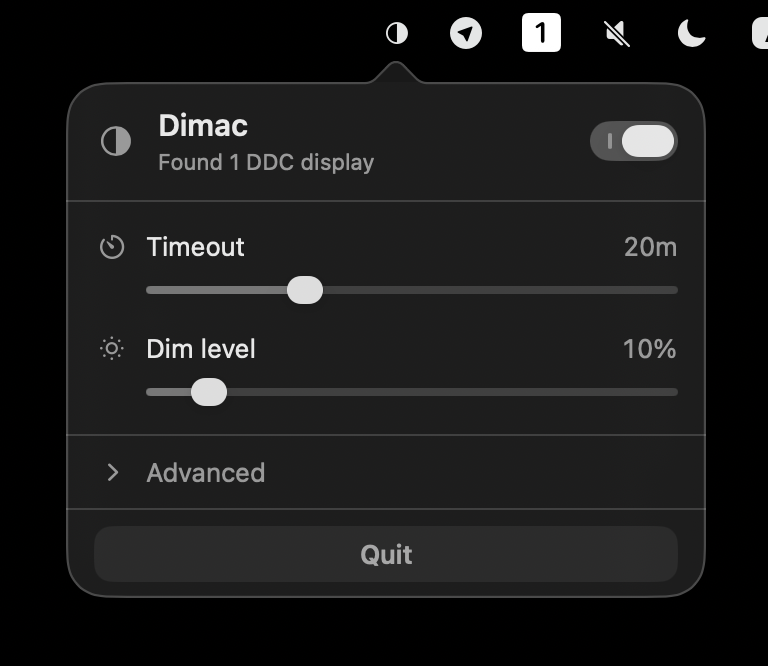
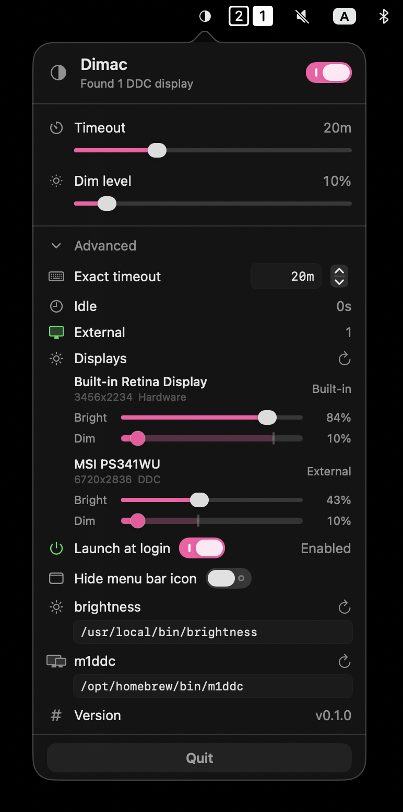

# Dimac

Dimac is a macOS menu bar app that dims displays after inactivity and restores the previous brightness as soon as input is detected.

## Screenshots

<p align="center">
  
  
</p>

## What It Does

- Dims built-in and external displays after an idle timeout.
- Restores brightness when mouse, keyboard, or scroll activity resumes.
- Stores per-display brightness preferences for external and hardware-controlled displays.
- Runs as a menu bar extra without a Dock icon.

## Requirements

- macOS 13 or newer
- Apple Silicon Mac (M-series)
- `m1ddc` for DDC-capable external displays
- `brightness` for built-in display control, hardware discovery, and CLI fallback paths

Dimac does not bundle, build, or vendor either helper tool. It looks for executable binaries on disk and runs them by path.

Recommended helper setup:

```sh
brew install m1ddc

git clone https://github.com/nriley/brightness.git
cd brightness
make
sudo make install
```

Dimac auto-detects helpers in common Homebrew locations, including `/opt/homebrew/bin` and `/usr/local/bin`. You can override both paths in `Advanced` settings.

`brightness` source-build instructions come from the upstream [`nriley/brightness`](https://github.com/nriley/brightness) project. If you prefer to build `m1ddc` from source too, that also works. Build it separately and point Dimac at the resulting binaries in `Advanced` settings.

See [INSTALL.md](INSTALL.md) for the recommended install paths and a dependency breakdown.

## Install

For most users, the shortest path is:

1. Install `m1ddc` with Homebrew and build `brightness` from source.
2. Build the app bundle with `zsh ./scripts/build-app.sh`.
3. Open `.build/release/Dimac.app`.

See [INSTALL.md](INSTALL.md) for the full source-build and helper-tool notes.

## Build

Build the Swift package:

```sh
swift build
```

Create an app bundle:

```sh
zsh ./scripts/build-app.sh
```

The app bundle is created at:

```text
.build/release/Dimac.app
```

## Test

Run the unit tests with:

```sh
zsh ./scripts/test.sh
```

If the script reports a Command Line Tools-only setup, switch to the full Xcode toolchain first:

```sh
sudo xcode-select -switch /Applications/Xcode.app/Contents/Developer
```

## Project Layout

- `Sources/Dimac`: app shell, menu bar UI, permissions, and settings
- `Sources/DimacCore`: dimming logic, brightness controllers, and persistence helpers
- `Tests/DimacCoreTests`: unit tests for core behavior
- `Tests/DimacTests`: app-layer tests for settings and integration behavior
- `scripts/build-app.sh`: app bundle packaging script

## Permissions And Privacy

Input Monitoring is optional. If it is already granted, Dimac can restore brightness a bit faster through an event-tap wake path. Without it, the app still restores normally through its idle polling path.

Dimac does not log keystrokes or send activity data anywhere.

The app stores:

- preferences in `UserDefaults`
- the active brightness snapshot in `~/Library/Application Support/Dimac/active-snapshot.json`

See [PRIVACY.md](PRIVACY.md) for the full data-handling note.

## Limitations

- Intel Macs are unsupported for now.
- Built-in display brightness uses Apple's private `DisplayServices.framework`, loaded dynamically at runtime. That is acceptable for local use but is not App Store-friendly.
- External display brightness depends on DDC support and `m1ddc`.
- Built-in dim/restore, hardware discovery, and some fallback control paths depend on the `brightness` CLI in the current implementation.

## Contributing

Start with [CONTRIBUTING.md](CONTRIBUTING.md), [SECURITY.md](SECURITY.md), and [CODE_OF_CONDUCT.md](CODE_OF_CONDUCT.md).

## License

Dimac is available under the [MIT License](LICENSE).
